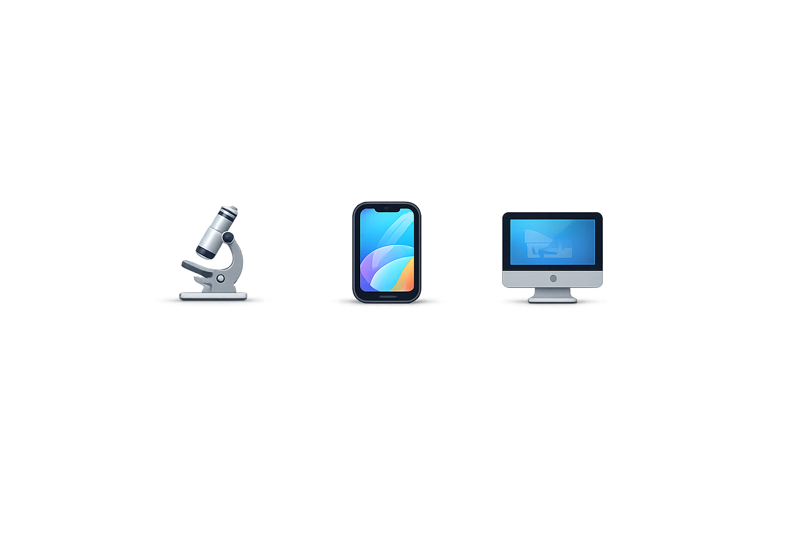
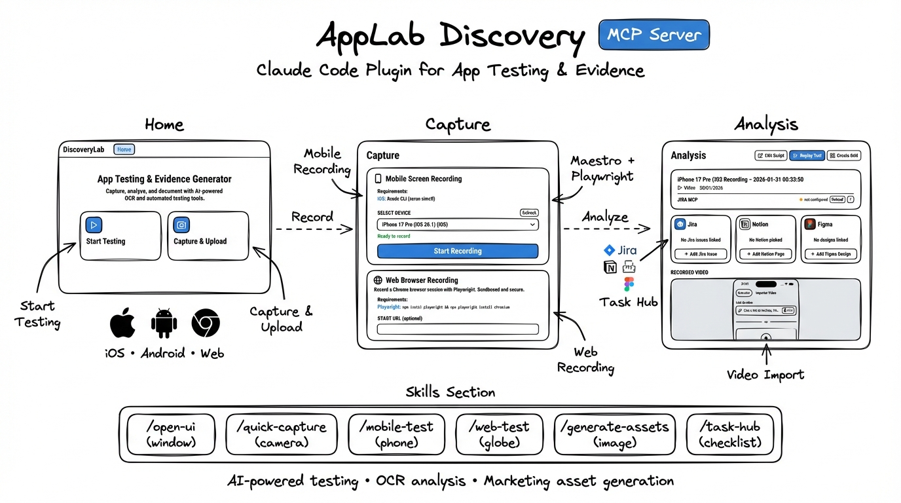
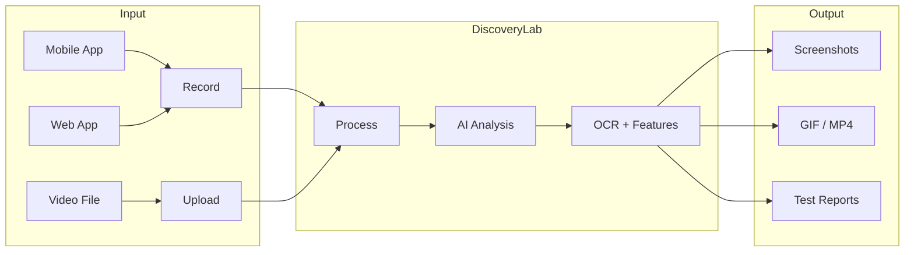

# DiscoveryLab

<div align="center">
    
    
</div>


[](https://www.npmjs.com/package/@veolab/discoverylab)
[](https://opensource.org/licenses/MIT)

> AI-powered app testing & marketing asset generator. A Claude Code plugin.



## How It Works



## Quick Start

```bash
npm install -g @veolab/discoverylab
discoverylab install   # configures Claude Code MCP
discoverylab serve     # opens web UI
```

## Features

| Feature | Description |
|---------|-------------|
| **Screen Capture** | Record iOS/Android emulators or web apps |
| **Maestro Testing** | Automated mobile app testing with screenshots |
| **Playwright Testing** | Web testing using your installed Chrome |
| **AI Analysis** | OCR, feature detection, smart summaries |
| **Export** | PNG, GIF, MP4 with professional quality |
| **Task Hub** | Jira, Notion, Figma, GitHub integration |

## Skills

After installing, use these in Claude Code:

```
/discoverylab:open-ui        → Open web interface
/discoverylab:quick-capture  → Capture emulator screen
/discoverylab:mobile-test    → Mobile testing with Maestro
/discoverylab:web-test       → Web testing with Playwright
```

## Requirements

- Node.js 20+
- FFmpeg (for video/GIF export)
- Maestro CLI (optional)
- Playwright (optional)

## Platform Support

| | macOS | Windows | Linux |
|---|:---:|:---:|:---:|
| Web UI | ✓ | ✓ | ✓ |
| iOS Capture | ✓ | — | — |
| Android Capture | ✓ | ✓ | ✓ |
| Web Recording | ✓ | ✓ | ✓ |
| Apple Vision OCR | ✓ | — | — |

## License

MIT
