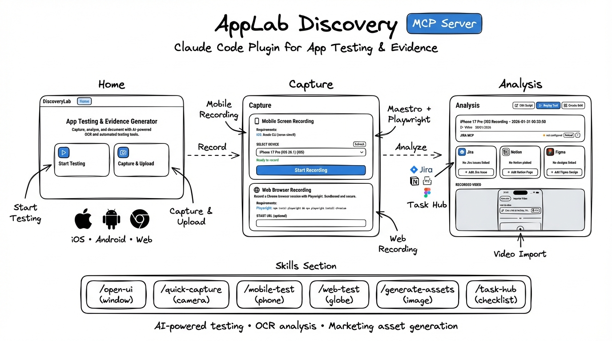
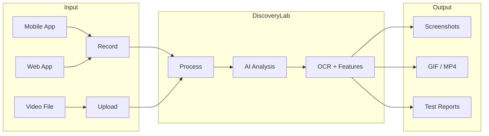

# DiscoveryLab

<div align="center">
    
    
</div>


[](https://www.npmjs.com/package/@veolab/discoverylab)
[](https://opensource.org/licenses/MIT)

> AI-powered app testing & marketing asset generator. A Claude Code plugin.



## How It Works


```mermaid
flowchart LR
    subgraph Input
        A[Mobile App] --> R[Record]
        B[Web App] --> R
        C[Video File] --> U[Upload]
    end

    subgraph DiscoveryLab
        R --> P[Process]
        U --> P
        P --> AI[AI Analysis]
        AI --> O[OCR + Features]
    end

    subgraph Output
        O --> E1[Screenshots]
        O --> E2[GIF / MP4]
        O --> E3[Test Reports]
    end
```

## Quick Start

```bash
npm install -g @veolab/discoverylab
discoverylab install   # configures Claude Code MCP
discoverylab serve     # opens web UI
```

`applab serve` works as an alias — both `discoverylab` and `applab` are interchangeable.
`serve` and `server` are also interchangeable.

## Features

| Feature | Description |
|---------|-------------|
| **Screen Capture** | Record iOS/Android emulators or web apps |
| **Maestro Testing** | Automated mobile app testing with screenshots |
| **Playwright Testing** | Web testing using your installed Chrome |
| **AI Analysis** | OCR, feature detection, smart summaries |
| **Export** | PNG, GIF, MP4 with professional quality |
| **Task Hub** | Jira, Notion, Figma, GitHub integration |
| **ESVP Client** | Connect to a shared ESVP control-plane for mobile sessions, replay, iOS Sim, and network traces |

## Skills

After installing, use these in Claude Code:

```
/discoverylab:open-ui        → Open web interface
/discoverylab:quick-capture  → Capture emulator screen
/discoverylab:mobile-test    → Mobile testing with Maestro
/discoverylab:web-test       → Web testing with Playwright
```

## Requirements

- Node.js 20+
- FFmpeg (for video/GIF export)
- Maestro CLI (optional)
- Playwright (optional)

## Platform Support

| | macOS | Windows | Linux |
|---|:---:|:---:|:---:|
| Web UI | ✓ | ✓ | ✓ |
| iOS Capture | ✓ | — | — |
| Android Capture | ✓ | ✓ | ✓ |
| Web Recording | ✓ | ✓ | ✓ |
| Apple Vision OCR | ✓ | — | — |

## ESVP Integration

AppLab Discovery can act as an open-source client for a self-hosted ESVP control-plane. This integration is intentionally thin: it only calls the public HTTP contract and does not embed any private Entropy Lab runtime code.

Default behavior:

- if `ESVP_BASE_URL` is set, DiscoveryLab uses a remote/shared ESVP server
- if `ESVP_BASE_URL` is not set, DiscoveryLab tries to boot an embedded local OSS runtime (`esvp-local`)

For development, until `@entropylab/esvp-local` is published, point the local runtime module explicitly:

```bash
export DISCOVERYLAB_ESVP_LOCAL_MODULE=/absolute/path/to/esvp-server-reference/server.js
```

To force remote mode, set the control-plane URL:

```bash
export ESVP_BASE_URL=http://your-esvp-host:8787
```

Local `external-proxy` capture is now backed by a bundled host runtime. To ship the binary inside `dist/runtime/esvp-host-runtime/`, run:

```bash
npm run build:host-runtime
```

Regular `npm run build` attempts this step in best-effort mode so the JS build still succeeds on machines without Rust, but distributable builds that need local capture should include the runtime binary.

Video templates are also staged automatically during `npm run build`. DiscoveryLab will copy templates from:

- `DISCOVERYLAB_TEMPLATE_SOURCE_DIR` if set
- otherwise `~/.discoverylab/templates`

into `dist/templates`, so npm packages and fresh installs keep the template toggle icons and Remotion renders working without a second manual copy step.

For a local distributable package that already contains the bundled runtime for the current host, run:

```bash
npm run pack:local
```

That produces the npm tarball with `dist/runtime/esvp-host-runtime/...` embedded, so the installed end-user package only needs `discoverylab serve` or `discoverylab server`.

Development vs packaged usage:

- local development can use `bun run dev`; when a bundled runtime is not present, App Lab falls back to `cargo run` if Rust is installed
- packaged/npm releases should be built with `npm run pack:local` or `npm publish`, which require the host runtime and embed it so end users only need `discoverylab serve` or `discoverylab server`
- the bundled runtime is currently host-target specific, so cross-platform distribution still needs a build matrix that produces binaries for each target you want to ship
- because App Lab is open source, the bundled runtime is intentionally limited to the local proxy/capture commodity path; it does not embed private Entropy Lab managed-proxy or protocol internals

Available MCP tools:

- `dlab.esvp.status`
- `dlab.esvp.devices`
- `dlab.esvp.sessions.list`
- `dlab.esvp.session.create`
- `dlab.esvp.session.get`
- `dlab.esvp.session.inspect`
- `dlab.esvp.session.transcript`
- `dlab.esvp.session.artifacts.list`
- `dlab.esvp.session.artifact.get`
- `dlab.esvp.session.actions`
- `dlab.esvp.session.checkpoint`
- `dlab.esvp.session.finish`
- `dlab.esvp.replay.run`
- `dlab.esvp.replay.validate`
- `dlab.esvp.session.network`
- `dlab.esvp.network.configure`
- `dlab.esvp.network.trace.attach`
- `dlab.project.esvp.current`
- `dlab.project.esvp.validate`
- `dlab.project.esvp.replay`
- `dlab.project.esvp.sync_network`
- `dlab.project.esvp.app_trace_bootstrap`

CLI surface:

- `discoverylab esvp status`
- `discoverylab esvp devices`
- `discoverylab esvp sessions`
- `discoverylab esvp create`
- `discoverylab esvp get <sessionId>`
- `discoverylab esvp inspect <sessionId>`
- `discoverylab esvp transcript <sessionId>`
- `discoverylab esvp artifacts <sessionId>`
- `discoverylab esvp artifact <sessionId> <artifactPath>`
- `discoverylab esvp actions <sessionId>`
- `discoverylab esvp checkpoint <sessionId>`
- `discoverylab esvp finish <sessionId>`
- `discoverylab esvp replay-run <sessionId>`
- `discoverylab esvp replay-validate <sessionId>`
- `discoverylab esvp replay-consistency <sessionId>`
- `discoverylab esvp network <sessionId>`
- `discoverylab esvp network-configure <sessionId>`
- `discoverylab esvp network-clear <sessionId>`
- `discoverylab esvp trace-attach <sessionId>`

Mobile recording bridge:

- App Lab mobile recordings can now sync `network_trace` artifacts from ESVP into the same `networkEntries` / segmented route tabs already used by web recordings.
- When ESVP traces include headers and request/response previews, the Analysis view now exposes a request inspector with segmented tabs for `Overview`, `Request`, `Response`, and `Headers`.
- Local MCP development can point `.mcp.json` at `node dist/index.js` so LLMs use the current branch build instead of `@latest`.
- App Lab exposes server routes for this bridge:
  - `POST /api/testing/mobile/recordings/:id/esvp/validate`
  - `POST /api/testing/mobile/recordings/:id/esvp/sync-network`
- Validation now uses the public executor that fits each platform:
  - Android recordings validate through `adb`
  - iOS recordings validate through `maestro-ios`
- `POST /api/testing/mobile/recordings/:id/esvp/validate` also accepts an optional `network` payload. If present, App Lab asks ESVP to configure the session before replaying the flow.
- App Lab local now prefers `network.mode=external-proxy`.
- In `external-proxy` mode, the proxy belongs to the App Lab client and App Lab only uses ESVP to persist `network_profile` / `network_trace`.
- If `network.mode` is omitted, App Lab defaults to `external-proxy`. `managed-proxy` remains available only when explicitly requested.
- If `external-proxy` is selected without an explicit `proxy.host` / `proxy.port`, App Lab now auto-starts a local HTTP proxy for the ESVP session and attaches the resulting `network_trace` when the session stops.
- Practical host rules for local proxying:
  - iOS Simulator can use `127.0.0.1` when the proxy runs on the same macOS host.
  - Android Emulator should use `10.0.2.2` to reach a proxy on the host.
  - Physical Android devices need a host/LAN IP, not `127.0.0.1`.
- Optional env vars for the client-owned proxy:
  - `DISCOVERYLAB_NETWORK_PROXY_PORT`
  - `DISCOVERYLAB_NETWORK_PROXY_HOST`
  - `DISCOVERYLAB_NETWORK_PROXY_BIND_HOST`
  - `DISCOVERYLAB_NETWORK_PROXY_PROTOCOL`
  - `DISCOVERYLAB_NETWORK_PROXY_BYPASS`
  - `DISCOVERYLAB_NETWORK_PROXY_MAX_DURATION_MS`
- Host compatibility for local proxying:
  - macOS host + iOS Simulator: supported. This is the only local iOS path, because Simulator / `maestro-ios` / `ios-sim` are macOS-only.
  - macOS host + Android Emulator / physical Android: supported, as long as `adb` is installed and the device is reachable.
  - Linux host + Android Emulator / physical Android: supported, as long as `adb` is installed and the device is reachable.
  - Android local proxying is not tied to macOS. The local proxy is a Node.js HTTP proxy and the ESVP `adb` executor applies the proxy through ADB.
- Android prerequisites:
  - `adb` must be installed and available on `PATH` before starting App Lab / ESVP flows.
  - Android Emulator should use `10.0.2.2` to reach the host proxy.
  - Physical Android devices must use a host/LAN IP reachable from the device.
  - `DISCOVERYLAB_NETWORK_PROXY_BIND_HOST` can be used when the proxy must listen on a LAN-facing interface instead of loopback.
- Safety defaults for the local proxy:
  - App Lab now auto-finalizes App-owned local proxies after `15m` by default to avoid leaving the host/device pointed at a stale proxy.
  - Auto-finalization clears ESVP network state, stops the local proxy, attaches the captured `network_trace`, and finishes the session.
  - App Lab Settings now expose an emergency lock for App-owned proxy autostart. Enabling it immediately finalizes active App-owned proxies and blocks new auto-started local proxies until you unlock it.
  - App Lab Settings also expose a `Disable Active Proxy Now` panic button that forces cleanup without changing the lock state.
  - Server shutdown always attempts the same cleanup path, so App-owned proxies are finalized automatically when the App Lab server exits normally.
  - Set `DISCOVERYLAB_NETWORK_PROXY_MAX_DURATION_MS=0` only if you explicitly want to disable this guardrail.
- Current limitation:
  - Automatic local proxying covers HTTP proxy setup and trace attach only. Advanced fault injection still requires explicit `managed-proxy`.
  - `managed-proxy` is still useful for public-runtime validation and fault-injection experiments.

Example request body for ESVP-backed validation with external proxy:

```json
{
  "network": {
    "mode": "external-proxy",
    "profile": "applab-standard-capture",
    "proxy": {
      "host": "10.0.2.2",
      "port": 8080
    }
  }
}
```

Example prompts for Claude Code or other MCP clients:

- `Check my ESVP control-plane health`
- `Create an ios-sim ESVP session and take a screenshot`
- `Create a maestro-ios ESVP session and replay this iOS recording with an external proxy`
- `Configure a proxy on this ESVP session and attach the HTTP trace from ./trace.json`
- `Replay the failing Android session on the current emulator`

Programmatic usage:

```ts
import { createESVPSession, runESVPActions } from '@veolab/discoverylab';

const created = await createESVPSession({
  executor: 'ios-sim',
  meta: { source: 'demo' },
});

await runESVPActions(created.session.id, {
  actions: [{ name: 'screenshot' }],
  finish: true,
});
```

## License

MIT
