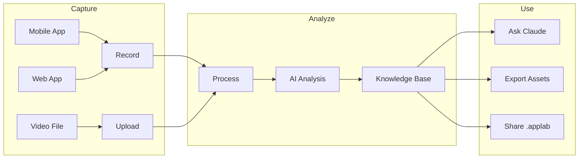

# DiscoveryLab

<div align="center">
    
    
</div>


[](https://www.npmjs.com/package/@veolab/discoverylab)
[](https://www.npmjs.com/package/@veolab/discoverylab)
[](https://github.com/veolab/applab-discovery/stargazers)
[](https://opensource.org/licenses/MIT)

> AI-powered app testing, documentation & knowledge base. A plugin for Claude Code and Claude Desktop.


## Quick Start

```bash
npm install -g @veolab/discoverylab
discoverylab install   # auto-detects Claude Code + Claude Desktop
discoverylab serve     # opens web UI at localhost:3847
```

`applab` works as an alias for `discoverylab`.

## What It Does

Record app flows. AI analyzes every screen. Ask Claude about any flow in natural language.


```mermaid
flowchart LR
    subgraph Capture
        A[Mobile App] --> R[Record]
        B[Web App] --> R
        C[Video File] --> U[Upload]
    end

    subgraph Analyze
        R --> P[Process]
        U --> P
        P --> AI[AI Analysis]
        AI --> K[Knowledge Base]
    end

    subgraph Use
        K --> Q[Ask Claude]
        K --> E[Export Assets]
        K --> S[Share .applab]
    end
```

## Features

| Feature | Description |
|---------|-------------|
| **Screen Capture** | Record iOS/Android emulators or web apps |
| **AI Analysis** | OCR, feature detection, smart summaries (Anthropic, OpenAI, Ollama, Claude CLI) |
| **Knowledge Brain** | Ask Claude about any captured flow — visual answers with interactive infographics |
| **Interactive Visualizations** | Flow Diagram, Device Showcase, Metrics Dashboard, App Flow Map |
| **Grid Assets** | Infographic grids with AI annotations, step badges, flow arrows |
| **Export** | PNG, GIF, MP4, HTML infographic, .applab bundle |
| **Document Composer** | Build rich Notion pages with preview before export |
| **Maestro Testing** | Automated mobile app testing with screenshots |
| **Playwright Testing** | Web testing using your installed Chrome |
| **Task Hub** | Jira, Notion, Figma, GitHub integration |
| **ESVP Protocol** | Mobile sessions, replay, and network traces ([docs](doc/esvp-protocol.md)) |
| **Share** | Export .applab bundles → import on another machine with full context |

## Claude Integration

### Claude Code (CLI)

Skills available after install:

```
/discoverylab:open-ui        → Open web interface
/discoverylab:quick-capture  → Capture emulator screen
/discoverylab:mobile-test    → Mobile testing with Maestro
/discoverylab:web-test       → Web testing with Playwright
/discoverylab:generate-assets → Create marketing assets
```

### Claude Desktop

Ask in natural language — Claude opens interactive visuals automatically:

```
"how does the login flow work?"     → opens infographic canvas
"what screens do we have captured?" → lists all projects
"show me the onboarding"            → visual flow map
```

### MCP Tools

```
dlab.knowledge.open     → visual infographic of a flow (HTML canvas)
dlab.knowledge.search   → text search across all projects
dlab.knowledge.summary  → overview of all captured knowledge
dlab.export.infographic → export self-contained HTML file
dlab.project.import     → import shared .applab bundle
```

## CLI Commands

```bash
discoverylab serve                              # start web UI
discoverylab install                            # auto-detect + configure MCP
discoverylab install --target desktop           # Claude Desktop only
discoverylab export <project-id> --format infographic --open
discoverylab import <file.applab>               # import shared project
discoverylab setup                              # check dependencies
discoverylab info                               # version info
```

## Requirements

- Node.js 20+
- FFmpeg (for video/GIF export)
- Maestro CLI (optional, for mobile testing)
- Playwright (optional, for web testing)

## Platform Support

| | macOS | Windows | Linux |
|---|:---:|:---:|:---:|
| Web UI | ✓ | ✓ | ✓ |
| iOS Capture | ✓ | — | — |
| Android Capture | ✓ | ✓ | ✓ |
| Web Recording | ✓ | ✓ | ✓ |
| Apple Vision OCR | ✓ | — | — |
| Claude Desktop | ✓ | ✓ | — |

## License

MIT
